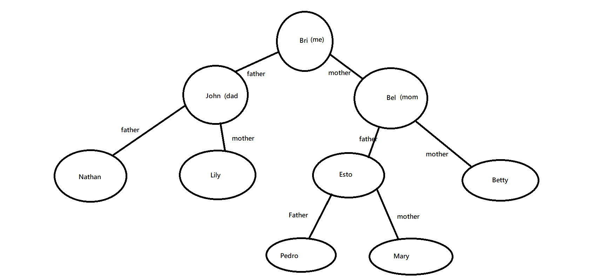
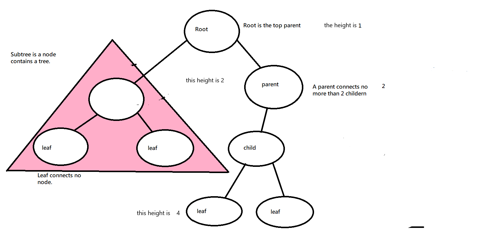

#Python Binary Tree Tutorial

- [back](../welcome.md)

##Introduction of Binary Tree:
A binary tree is a tree data structure in which each node has at most two children, which are referred to as the left child and the right child. 

In computing, binary trees are mainly used for searching and sorting as they provide a means to store data hierarchically. 

It is also possible to interpret a binary tree as an undirected, rather than a directed graph, in which case a binary tree is an ordered, rooted tree.    


**Example of a Binary Tree:**
A perfect example of a Binary tree may be Genealogy. 
The picture below is a good demo of it. This is part of my family tree:



##Important elements of Binary tree:

**Parent/Child:**
A parent node can have no more than two child nodes.
If we want to insert or remove a child node, the BigO will be O(log n) because it we do not need to all of the spots to perform.

**Root/leaf:**
A Root node is the top parent node of the whole tree. 
If a node does not have any child node, that node will be called as LEAF. 

**Subtree:**
In computer science, a tree can be treated as a node. If a tree becomes a child node of a node. That tree is the Subtree. 

**Height:**
Height of a node is what hierarchys it belongs to. Determine the height of a node is O(log n) because we will only trace how many hierachys it has.

**Tarverse:**
The process of visiting all nodes (and subsequently their values) in a tree.




The class below is the how the tree is set up.
```python
class BST:
    """
    Implement the Binary Search Tree (BST) data structure.  The Node 
    class below is an inner class.  An inner class means that its real 
    name is related to the outer class.  To create a Node object, we will 
    need to specify BST.Node
    """

    class Node:
        """
        Each node of the BST will have data and links to the 
        left and right sub-tree. 
        """

        def __init__(self, data):
            """ 
            Initialize the node to the data provided.  Initially
            the links are unknown so they are set to None.
            """
       
            self.data = data
            self.left = None
            self.right = None

    def __init__(self):
        """
        Initialize an empty BST.
        """
        self.root = None

    def insert(self, data):
        """
        Insert 'data' into the BST.  If the BST
        is empty, then set the root equal to the new 
        node.  Otherwise, use _insert to recursively
        find the location to insert.
        """
        if self.root is None:
            self.root = BST.Node(data)
        else:
            self._insert(data, self.root)  # Start at the root

    def _insert(self, data, node):
        """
        This function will look for a place to insert a node
        with 'data' inside of it.  The current sub-tree is
        represented by 'node'.  This function is intended to be
        called the first time by the insert function.
        """
        if data < node.data:
            # The data belongs on the left side.
            if node.left is None:
                # We found an empty spot
                node.left = BST.Node(data)
            else:
                # Need to keep looking.  Call _insert
                # recursively on the left sub-tree.
                self._insert(data, node.left)
        elif data == node.data:
            pass
        else:
            # The data belongs on the right side.
            if node.right is None:
                # We found an empty spot
                node.right = BST.Node(data)
            else:
                # Need to keep looking.  Call _insert
                # recursively on the right sub-tree.
                self._insert(data, node.right)
    
   

    def __contains__(self, data):
        """ 
        Checks if data is in the BST.  This function
        supports the ability to use the 'in' keyword:
        """
        return self._contains(data, self.root)  # Start at the root

  
    def _contains(self, data, node):
        """
        This funciton will search for a node that contains
        'data'.  The current sub-tree being search is 
        represented by 'node'.  This function is intended
        to be called the first time by the __contains__ function.
        """
        if node is not None:
            if data < node.data:
                return self._contains(data, node.left)
            elif data > node.data:
                return self._contains(data, node.right)
            elif data == node.data:
                return True
        else:
            return False
        

    

    def __iter__(self):
        """
        Perform a forward traversal (in order traversal) starting from 
	    the root of the BST.  This is called a generator function.
        This function is called when a loop	is performed:

        for value in my_bst:
            print(value)

        """
        yield from self._traverse_forward(self.root)  # Start at the root
        
    def _traverse_forward(self, node):
        """
        Does a forward traversal (in-order traversal) through the 
        BST.  If the node that we are given (which is the current
        sub-tree) exists, then we will keep traversing on the left
        side (thus getting the smaller numbers first), then we will 
        provide the data in the current node, and finally we will 
        traverse on the right side (thus getting the larger numbers last).
        """
        if node is not None:
            yield from self._traverse_forward(node.left)
            yield node.data
            yield from self._traverse_forward(node.right)
        

    def get_height(self):
        """
        Determine the height of the BST.  Note that an empty tree
        will have a height of 0 and a tree with one item (root) will
        have a height of 1.
        
        If the tree is empty, then return 0.  Otherwise, call 
        _get_height on the root which will recursively determine the 
        height of the tree.
        """
        if self.root is None:
            return 0
        else:
            return self._get_height(self.root)  # Start at the root

 
    def _get_height(self, node):
        """
        Determine the height of the BST.  The height of a sub-tree 
        (represented by 'node') is 1 plus the height of either the 
        left sub-tree or the right sub-tree (whichever one is bigger).

        This function intended to be called the first time by 
        get_height.
        """
        if node is None:
            return 0
        else:
            return max(self._get_height(node.left), self._get_height(node.right)) + 1
```
The questions are below, try to answer the questions before putting the code in.
```python
tree = BST()
tree.insert(11)
tree.insert(12)
tree.insert(7)
tree.insert(7)
tree.insert(7)  
tree.insert(2)
tree.insert(2)
tree.insert(1)
tree.insert(6)
tree.insert(5)
print("The nodes are:")
for x in tree:
    print(x, end = " ") 
# Try to find the nodes here
print()
print()
print(f"The height is: {tree.get_height()}")
# Try to find the height of the tree here
tree.insert(8)
print()
print(f"The height is: {tree.get_height()}")
# Try to find the height of the tree here
tree.insert(3)
print()
print(f"The height is: {tree.get_height()}")
# Try to find the height of the tree here
```

# - [Answer](../tree-A.md)


# - [back](welcome.md)